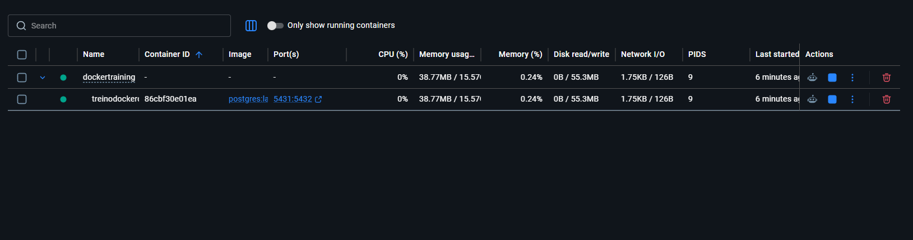
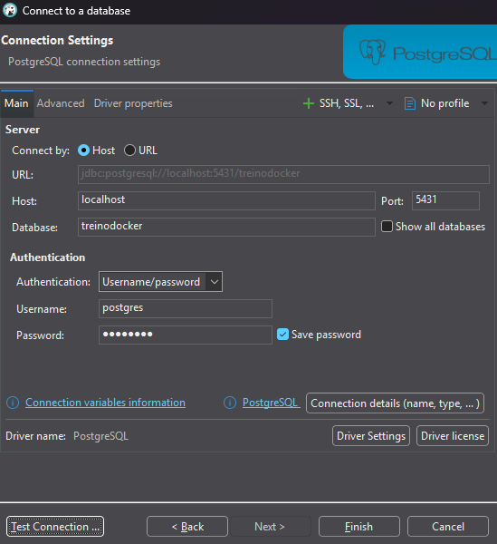

# Docker Compose + PostgreSQL

Projeto desenvolvido para estudar a utilização do Docker Compose na criação e gerenciamento de serviços relacionados a uma aplicação.

## Objetivo

O objetivo deste projeto é compreender como utilizar o Docker Compose para subir e gerenciar um banco de dados PostgreSQL de forma padronizada entre diferentes ambientes de desenvolvimento.

## O que é Docker Compose?

O Docker Compose é uma ferramenta que permite definir e executar múltiplos containers através de um único arquivo de configuração (`docker-compose.yml`).

Com apenas um comando é possível iniciar toda a infraestrutura necessária para uma aplicação.

## Por que utilizar Docker Compose?

### Não precisamos instalar o banco de dados na máquina

Ao utilizar Docker Compose, o PostgreSQL roda dentro de um container.

Isso elimina a necessidade de:

* Instalar PostgreSQL localmente.
* Configurar variáveis de ambiente manualmente.
* Gerenciar diferentes versões do banco.

### Todos os desenvolvedores utilizam a mesma versão

Com Docker Compose toda a equipe utiliza exatamente:

* A mesma imagem.
* A mesma configuração.
* A mesma versão do PostgreSQL.

Isso reduz problemas de compatibilidade entre ambientes.

### Ambiente reproduzível

Qualquer pessoa consegue iniciar o projeto executando apenas:

```bash
docker compose up -d
```

Sem necessidade de instalar ou configurar o banco manualmente.

## Arquitetura

```text
┌─────────────────┐
│     DBeaver     │
└────────┬────────┘
         │
         ▼
┌─────────────────┐
│   PostgreSQL    │
│   Container     │
└────────┬────────┘
         │
         ▼
┌─────────────────┐
│ Docker Compose  │
└─────────────────┘
```

## Estrutura do Projeto

```text
.
├── docker-compose.yml
├── pom.xml
├── src
└── README.md
```

## Configuração do PostgreSQL

Banco:

```text
treinodocker
```

Usuário:

```text
postgres
```

Porta:

```text
5431
```

## docker-compose.yml

```yaml
services:

  postgres:
    image: postgres:17

    container_name: postgres-db

    environment:
      POSTGRES_DB: treinodocker
      POSTGRES_USER: postgres
      POSTGRES_PASSWORD: postgres

    ports:
      - "5431:5432"
```

## Comandos Utilizados

### Iniciar os containers

```bash
docker compose up -d
```

### Verificar containers em execução

```bash
docker ps
```

### Visualizar logs

```bash
docker logs postgres-db
```

### Parar os containers

```bash
docker compose down
```

### Remover containers e volumes

```bash
docker compose down -v
```

## Conectando pelo DBeaver

Host:

```text
localhost
```

Porta:

```text
5431
```

Banco:

```text
treinodocker
```

Usuário:

```text
postgres
```

Senha:

```text
postgres
```

## Evidências

### Estrutura do Projeto

Resultado da execução do Docker Compose com o banco PostgreSQL disponível na porta 5431:

```markdown

```

### Conexão com PostgreSQL via DBeaver

Resultado  da conexão realizada:

```markdown

```

## Aprendizados

Durante este projeto foram praticados os seguintes conceitos:

* Docker Compose
* Containers
* Imagens Docker
* PostgreSQL
* Variáveis de ambiente
* Port Mapping
* Persistência de dados
* Integração com DBeaver
* Gerenciamento de serviços através do Compose

## Resultado Final

Ao final deste projeto foi possível:

* Executar PostgreSQL sem instalação local.
* Padronizar o ambiente de desenvolvimento.
* Utilizar a mesma versão do banco para todos os desenvolvedores.
* Gerenciar serviços através do Docker Compose.
* Conectar ferramentas externas ao banco executando em container.
